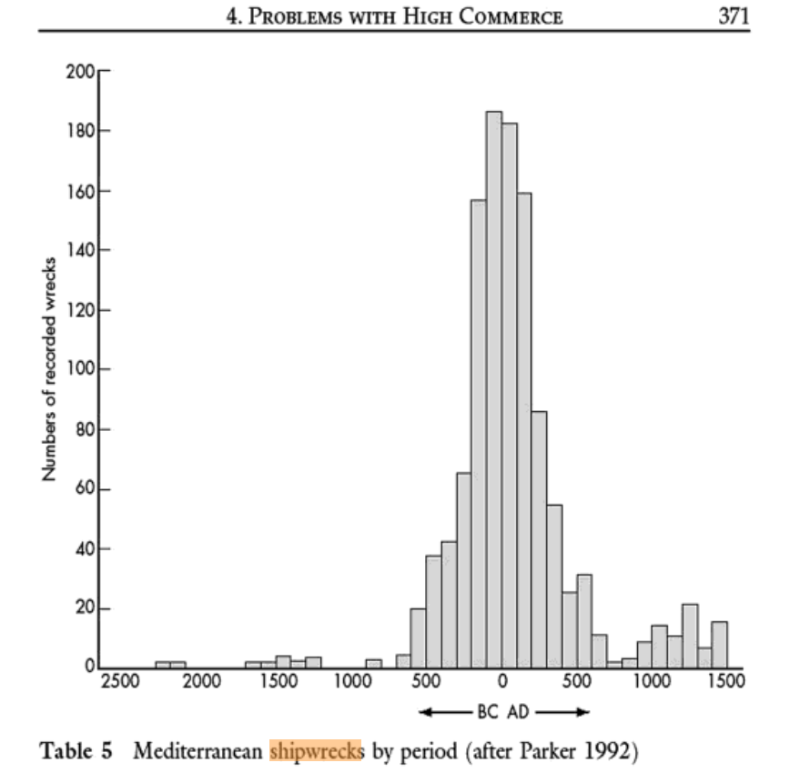

```{r setup, include=FALSE}
knitr::opts_chunk$set(
  echo = FALSE,
  warning = FALSE,
  include = FALSE
  )

library(dplyr)
library(ggplot2)
library(ggspatial)
library(readr)
library(rnaturalearth)
library(sf)
library(viridis)

shipwrecks <- read_csv("processed_data/shipwrecks.csv")

```

The starting point for this challenge is an often-cited graph in Peregrine Horden
and Nicholas Purcell's book, *The Corrupting Sea* [-@horden2000].



The graph featured by Horden and Purcell is part of a larger argument that the volume of sea-borne
trade in the Mediterranean was larger in the 2nd century CE than at any other time before the 19th
century.

This argument depends upon several things:

1. The first premise is that Mediterranean commercial ship manufacture and sailing techniques
   remained relatively consistent from at least 500 BCE until the 16th century CE.

2. The second premise is that the frequency of shipwreck-inducing events in the Mediterranean (e.g.
   storms) remained relatively consistent over the period (2500 BCE to 1500 CE).

Given these premises, the number of shipwrecks can then constitute a fairly direct index of the
overall level of maritime economic activity in the Mediterranean.^[For a fuller introduction to the
possibilities and problems of ancient shipwrecks for economic analysis, see 
@knappett_shipwrecks_2018.]

Can we recreate this graph using a more recent dataset than Horden and Purcell (who worked from 
Parker's [-@parker_ancient_1992] book on ancient shipwrecks)? Is Horden and Purcell's argument borne
out in more up-to-date evidence, especially given the explosion of shipwreck archaeology in the past
twenty years?

# The Challenge

This challenge is structured in a series of steps, including obtaining the data, modifying the data
in order to support various forms of analysis, and then presenting findings in tabular and graphic
forms. These are core tasks in any form of data analysis.

For each section, there are a set of questions and tasks. Not all of these will be able to be
answered with the data in its original form.

# Get the data

Download a copy of the dataset [@strauss_shipwrecks_2013] listed below, import the data, and carry 
out the following tasks.

> Strauss, Julia. 2013. 'Shipwrecks Database'. *The Oxford Roman Economy Project*.\
> oxrep.classics.ox.ac.uk/databases/shipwrecks_database/.

1. Set up a new project in RStudio for your analysis. Your project should include the following
   files and folders:
   - a `.gitignore` file for R
   - a `data_raw` directory for downloaded data sources
   - a `data_processed` directory for cleaned data ready for analysis
   For the `.gitignore` file, think about whether you want to commit the outputs of your analysis
   or not (mostly, you should not: outputs are livestock, not pets).

2. Download the data. There is zip file of the dataset, which you can find by:
   - going to the URL above;
   - scrolling to the bottom of the page;
   - finding the link embedded in the text, under the word "here".

3. Import the data into R. Think about how the columns/variables are named, and what data types are
   imported. You may wish to modify the column names and/or use a `col_types =` argument (see the
   docs for `readr::read_csv`) to control how the data is imported.

4. Save the data into your project and then make the initial commit in Git.

```
# in the Terminal
> git status
> git add .
> git commit -m "Initial commit."
```

5. Make an initial summary of the variables in the dataset:
  - What does each column contain?
  - What is the range of values in each column?
  - What data is missing (consider both NA values, and other "missing data" values e.g. 0, -1 etc.)?

# Dates

You may have noticed that columns `date_range` and `mid_point_of_date_range` variables contain only
zeros. Data is missing here, but it is possible to calculate and fill in values for these columns
using data in other columns.

Fix this missing data.

1. Calculate the mid-point and fill the `mid_point_of_date_range` column.
2. Calculate the date range (which amounts to a measure of the uncertainty of the dating) and fill
   the `date_range` column with data. Remember that the dates include negative values (BCE).

```{r shipwrecks-dates}

date_range <- function(earliest, latest) {
  abs(latest) - abs(earliest)
}


shipwrecks_dates <- shipwrecks %>% 
  mutate(
    date_range = date_range(earliest_date, latest_date)
  ) %>% 
  mutate(
    mid_point_of_date_range = round((earliest_date + latest_date) / 2, 0)
  )

```

Using the updated data, answer these questions:

1.  How many shipwrecks are there in the data?
2.  What is the earliest shipwreck?
3.  What is the latest shipwreck?
4.  How many shipwrecks fall between 100 BCE and 100 CE?

```{r}
shipwrecks_dates %>% 
  summarise(
    count = n(),
    earliest = min(mid_point_of_date_range, na.rm = TRUE),
    latest = max(mid_point_of_date_range, na.rm = TRUE)
  )
```

## Locations

1.  What countries have the shipwrecks been found in?
2.  The "countries" \``ZZ-Non-Mediterranean` and `International waters` form part of the dataset.
    Can we mine some other part of the data to supply more information? How might we go about this?
3.  How many wrecks have been discovered in each country?
4.  How many shipwrecks in the database have a location specified by a valid lat-long pair?

### What countries?

```{r}
wreck_countries <- unique(shipwrecks_dates$country)

wreck_countries
```

## Shipwrecks with valid lat-long pair?

```{r valid-lat-long-count}

shipwrecks_dates %>% 
  filter(
    !is.na(latitude) | !is.na(longitude)
  ) %>% 
  filter(
    !(latitude == 0 & longitude == 0)
  ) %>% 
  summarise(
    count = n(),
    earliest = min(mid_point_of_date_range, na.rm = TRUE),
    latest = max(mid_point_of_date_range, na.rm = TRUE),
    min_lat = min(latitude, na.rm = TRUE),
    max_lat = max(latitude, na.rm = TRUE),
    min_long = min(longitude, na.rm = TRUE),
    max_long = max(longitude, na.rm = TRUE)
  )

```

## Main challenge

Try to recreate the graph given in Horden and Purcell (2000) as Table 5. Do the contents of the
Shipwrecks Database, with twenty more years data than Parker 1992, back up the original conclusion?

What improvements can you make to the original presentation of the graph?

```{r}

shipwrecks_dates %>% 
  ggplot() +
  geom_histogram(aes(x = mid_point_of_date_range), binwidth = 50) +
  scale_x_continuous(
    breaks = c(-2000, -1500, -1000, -500, 1, 500, 1000, 1500),
    labels = c(
      "2000 BCE", "1500 BCE", "1000 BCE", "500 BCE", "1 CE", "500 CE", "1000 CE", "1500 CE"
      )
  ) +
  theme_bw() +
  theme(
    plot.caption = ggtext::element_textbox_simple(halign = 1, margin = ggplot2::margin(6, 0, 0, 0))
  ) +
  labs(
    x = "Approximate date",
    y = "Count",
    title = "Ancient Mediterranean shipwrecks, 2200 BCE to 1500 CE",
    subtitle = paste0(
      "On the evidence of shipwrecks, the period 100 BCE to 100 CE was the greatest period of\n",
      "maritime trade in the Mediterranean until the modern era (Horden and Purcell 2000, 371-372)."
    ),
    caption = paste(
      "Data from Strauss, Julia. 2013. ‘Shipwrecks Database’.",
      "*The Oxford Roman Economy Project*.",
      "oxrep.classics.ox.ac.uk/databases/shipwrecks_database/."
    )
  )


```

## Bonus challenge

1.  Plot the shipwrecks that have valid long-lat coordinates onto a map (use `ggplot` and
    `rnaturalearth` for the maps).

    -   Read the `ggplot2` in-progress book (3rd edition) about mapping:\
        <https://ggplot2-book.org/maps.html>.

    -   Use these snippets to add a map layer from `rnaturalearth`:

        -   `world <- ne_countries(scale = "medium", returnclass = "sf")`
        -   `ggplot(data = world) + geom_sf()`

2.  Create a faceted set of maps on some variable of your choice, e.g. date ranges.

```{r plot_shipwrecks, fig.height=8}
# get data for labelling individual countries
countries <- read_tsv("processed_data/countries.tsv") %>% 
  # only relevant countries for the shipwreck data
  filter(
    name %in% unique(shipwrecks_dates$country)
  ) %>% 
  # avoid name clash
  select(-name)
# add labelling data onto the Natural Earth countries data
world <- ne_countries(scale = "medium", returnclass = "sf") %>% 
  left_join(countries, by = c("iso_a2" = "country"))

shipwrecks_dates_locations <- shipwrecks_dates %>%
  filter(
    !is.na(latitude) | !is.na(longitude)
  ) %>% 
  filter(
    !(latitude == 0 & longitude == 0)
  )

# make the plot
ggplot() +
  # set up the world map with NE countries data
  geom_sf(data = world, fill = "antiquewhite") +
  # layer on points for the shipwrecks
  geom_point(
    data = shipwrecks_dates_locations, aes(
      x = longitude, 
      y = latitude, 
      colour = mid_point_of_date_range,
    ), 
    alpha = 0.75, size = 3
  ) +
  # add labels for relevant countries
  geom_label(
    data = world, aes(x = longitude, y = latitude, label = name), nudge_y = 0.3, size = 3
  ) +
  # crop the map to the Mediterranean
  coord_sf(xlim = c(-1, 35), ylim = c(30, 47), expand = TRUE) +
  # select an appropriate colour scale
  scale_color_viridis_b(name = "Approx.\ndate", option = "plasma") +
  # adjust the overall visual appearance
  theme_bw() +
  theme(
    panel.grid.major = element_line(color = gray(0.5), linetype = "dashed", size = 0.5),
    panel.background = element_rect(fill = "lightsteelblue1"),
    plot.caption = ggtext::element_textbox_simple(halign = 1.01, margin = ggplot2::margin(6, 0, 0, 0))
  ) +
  # add labels for the overall map
  labs(
    title = "Ancient Mediterranean shipwrecks",
    subtitle = "358 wrecks with known location data, 1800 BCE to 1500 CE",
    caption = paste(
      "Data from Strauss, Julia. 2013. ‘Shipwrecks Database’.",
      "*The Oxford Roman Economy Project*.",
      "oxrep.classics.ox.ac.uk/databases/shipwrecks_database/."
    )
  ) +
  # add direction and scale annotations from the package `ggspatial`
  annotation_scale(location = "bl", width_hint = 0.4) +
  annotation_north_arrow(
    location = "bl", 
    which_north = "true",
    pad_x = unit(1, "cm"),
    pad_y = unit(1, "cm")
  )

ggsave("output/shipwrecks_plot.png", device = png)
```

# References
