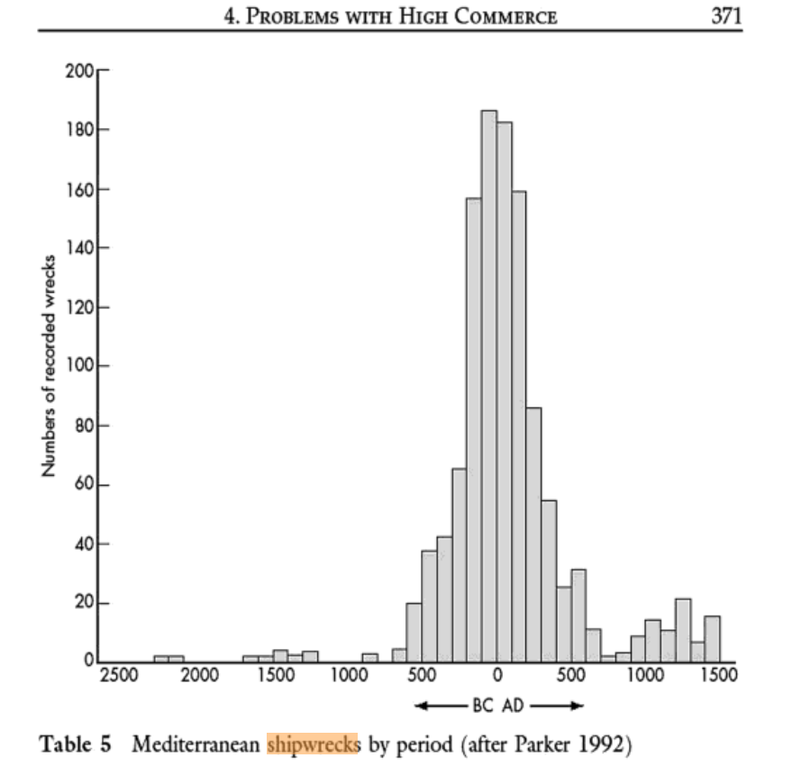

---
output:
  pdf_document: default
  html_document: default
---
# Ancient Mediterranean shipwrecks

## References

- Horden, Peregrine, and Nicholas Purcell. 2000.
  *The Corrupting Sea: A Study of Mediterranean History*. Wiley.
- Strauss, Julia. 2013. ‘Shipwrecks Database’. *The Oxford Roman Economy Project*. \
  oxrep.classics.ox.ac.uk/databases/shipwrecks_database/.
  
## The image

## Discussion

Hordern and Purcell quote Pliny’s *Natural History* 14.2 as one of the epigraphs for the section
that features this graph (Chapter IX Mobility of Goods and People).

> quis enim non communicato orbe terrarum maiestate Romani imperii profecisse vitam putet 
> commercio rerum ac societate festae pacis omniaque, etiam quae ante occulta fuerant, in 
> promiscuo usu facta?
>
> For who would not acknowledge that life has progressed, now that the world has been joined 
> together under the sovereignty of the Roman empire, through trade in goods and through joint
> enjoyment of the celebrations of peace, and that all manner of things, even those which had
> previously been hidden, have now been put into general usage?
>
> --- Pliny, *Natural History* 14.2

The key observation that Horden and Purcell make in relation to Table 5.

> “One arresting feature of the shipwreck evidence is the relatively poor showing made by the
> commercial boom, which, on the conventional view, began in the thirteenth century. We know of many
> more imperial Roman wrecks than late medieval or early modern ones. … Our argument throughout has
> been designed to re-open the possibility that on some notional scale of quantities or values,
> second-century trade was significantly greater than trade at any other time before the nineteenth
> century.”
> 
> --- Hordern and Purcell 2000, 371--372.

There are caveats about the nature of shipwreck evidence: in particular, changes in cargo (amphorae
give way to containers, but amphorae are more visible in archaeological record) and the potential
for differing rates of vulnerability to storms between the ancient and medieval periods.

